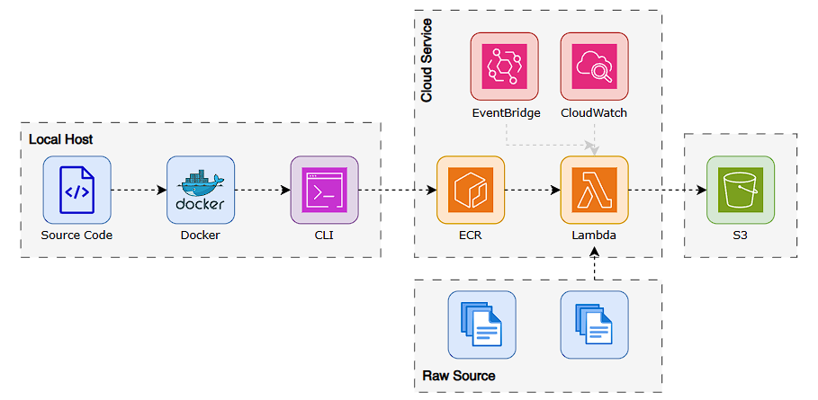
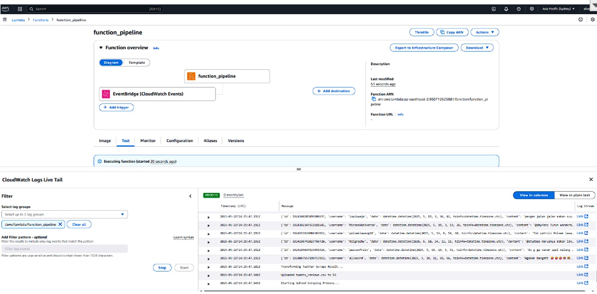
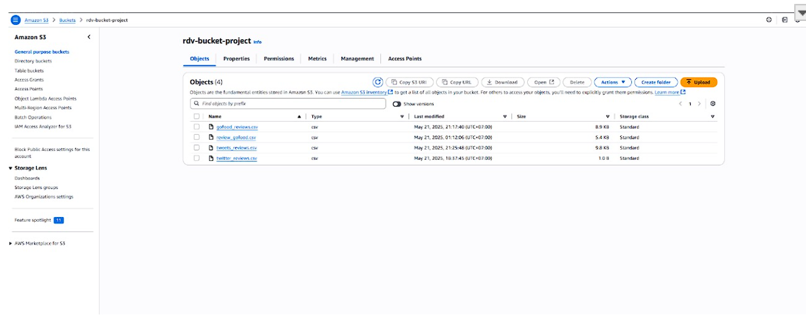

# GoFood & Twitter Review ETL Pipeline using AWS Lambda & Docker


This project is designed to automate the extraction, transformation, and loading (ETL) of user review data from two main sources: GoFood (a food delivery web platform) and Twitter. The solution leverages serverless technologies from AWS, particularly AWS Lambda with container support, enabling custom environments for complex scraping tasks using tools like Selenium.

The entire workflow is containerized with Docker and deployed using Amazon Elastic Container Registry (ECR). It is scheduled and triggered via AWS EventBridge and monitored through AWS CloudWatch. The transformed data is finally stored in Amazon S3 for further use in analysis or visualization.

## Project Goals
1. **Automate the Full ETL Process :**
Build a fully automated data pipeline that extracts reviews from GoFood and Twitter, processes them, and uploads the results to cloud storage.

2. **Enable Serverless Execution :**
Utilize containerized AWS Lambda functions to run scraping tasks in a scalable, serverless architecture.

3. **Ensure Scheduled & Repeatable Workflows :**
Implement automatic scheduling via AWS EventBridge to run the pipeline periodically with no manual triggers required.

4. **Apply Cloud-Native Security & Monitoring :**
Use IAM for permission control and CloudWatch for logs and monitoring, adhering to AWS best practices.

## Tech Stack
- Python
- Selenium + BeautifulSoup (for GoFood scraping)
- twscrape (for Twitter scraping)
- Pandas (for data processing)
- Docker
- AWS Services

## AWS Services Used

| AWS Service     | Role  |
| :-------------- | :------- | 
| `Amazon S3`       | `Stores processed review datasets (CSV format)`| 
| `AWS Lambda` | `Executes the ETL process using custom container image` | 
| `AWS CloudWatch`  | `Logs and monitors Lambda function execution` | 
| `AWS EventBridge` | `Triggers Lambda function at defined intervals` | 
| `AWS IAM`       | `Manages secure, minimal-permission access control` | 
| `AWS ECR` | `Stores Docker container image used by Lambda` |

## Getting Started
### Prerequisite
1. Have an active AWS account
2. Having CLI configured for AWS usage
3. Docker installed

### Docker Containerization & ECR Upload
`Build the image`
```Bash
docker build -t gofood-twitter-etl .
```
`Create a repository to store the image in aws ECR`
```Bash
aws ecr create-repository --repository-name gofood-twitter-etl
```
`Tag the image (adjust base on your AWS configuration)`
```Bash
docker tag gofood-twitter-etl:latest <account_id>.dkr.ecr.<region>.amazonaws.com/gofood-twitter-etl
```
`Push the image to AWS ECR`
```Bash
docker push <account_id>.dkr.ecr.<region>.amazonaws.com/gofood-twitter-etl
```
### AWS Lambda Execution (Container-Based)
1. Create new lambda function
2. Set function to use container image base
3. Configure all the other services manually (Currently on progress making all automated using CLI)

## Project Documentation
`Lambda process`



`S3 Storage after process completed`


